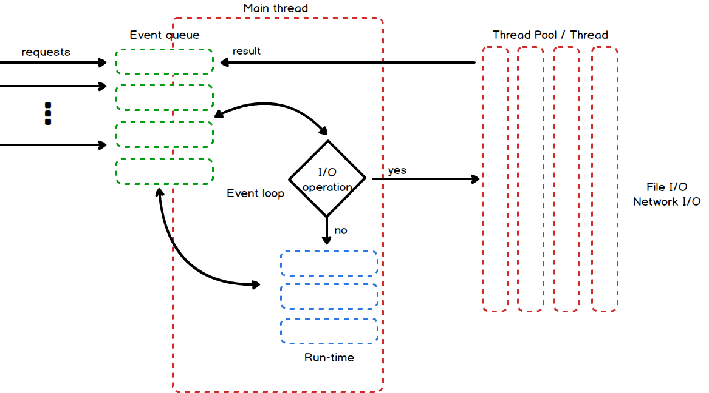
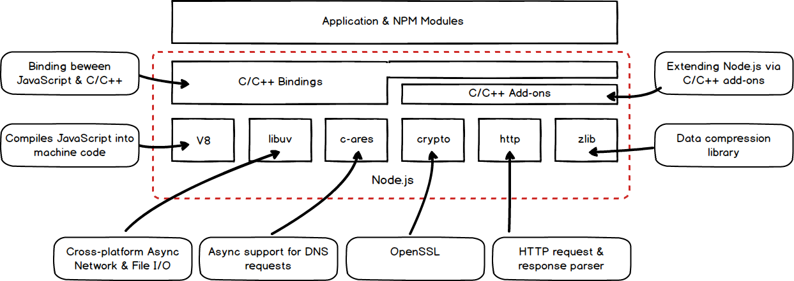
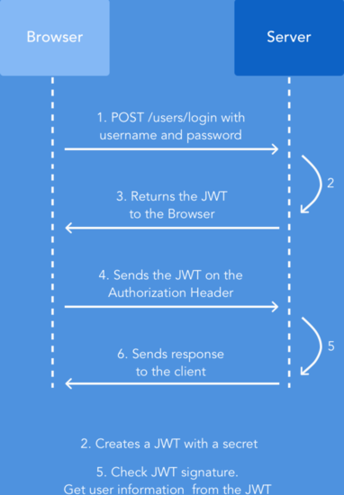
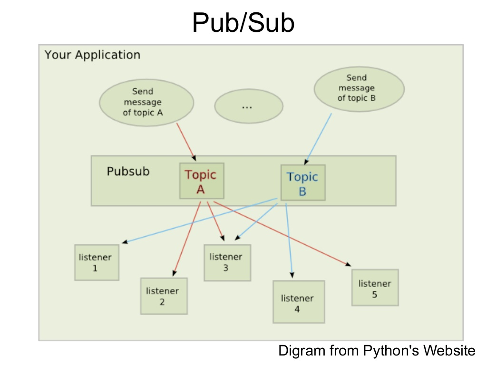
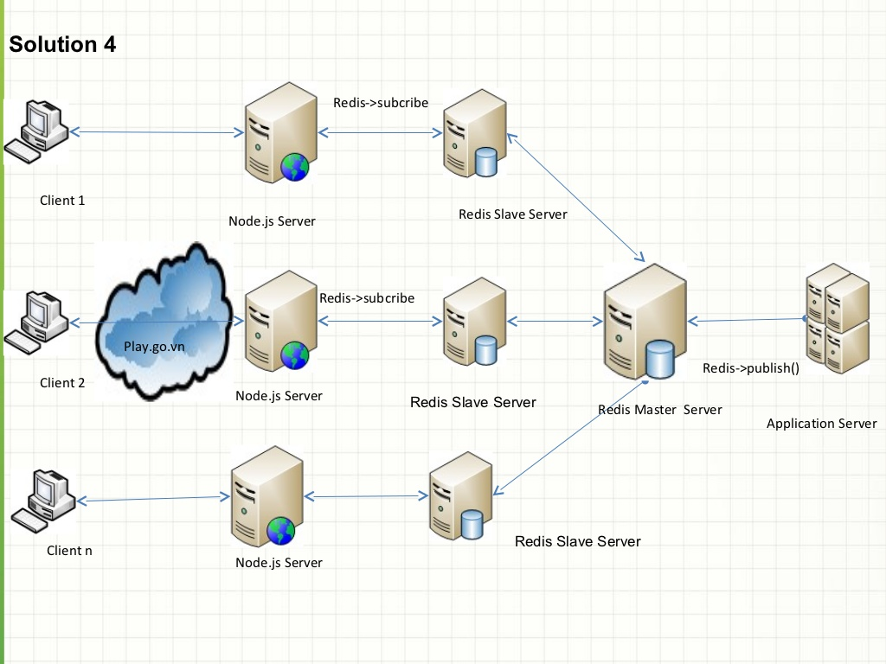

### Redux Life Cycle

### Node.js Architecture & Inner Workings

### JWT Token(client-side) vs Session Cookie(server-side)

[JSON Web Tokens vs. Session Cookies: In Practice](https://ponyfoo.com/articles/json-web-tokens-vs-session-cookies)

### socket.io, redis

