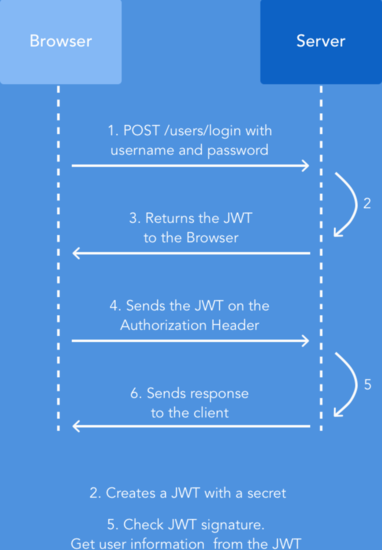
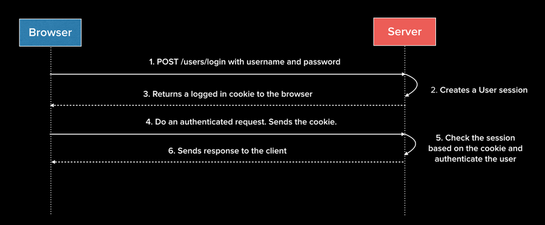

### Redux Life Cycle

### JWT Token(client-side) vs Session Cookie(server-side)
[JSON Web Tokens vs. Session Cookies: In Practice](https://ponyfoo.com/articles/json-web-tokens-vs-session-cookies)

