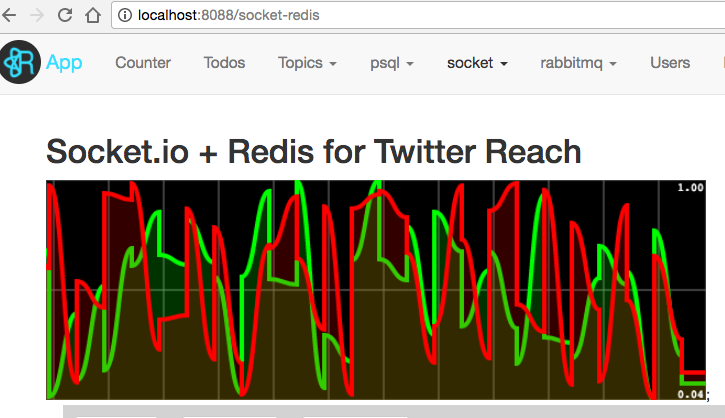

### Redux Life Cycle

### Node.js Architecture & Inner Workings

### JWT Token(client-side) vs Session Cookie(server-side)

[JSON Web Tokens vs. Session Cookies: In Practice](https://ponyfoo.com/articles/json-web-tokens-vs-session-cookies)

### socket.io, redis

#### Chat + Socket.io

#### Login + MongoDB

#### PostgreSQL

#### React-routers

#### Server delegate + Redux-Form 

#### Socket + redis + canvas

#### User CRUD + bootstrap-modal

#### User Search + MongoDB + Rxjs

